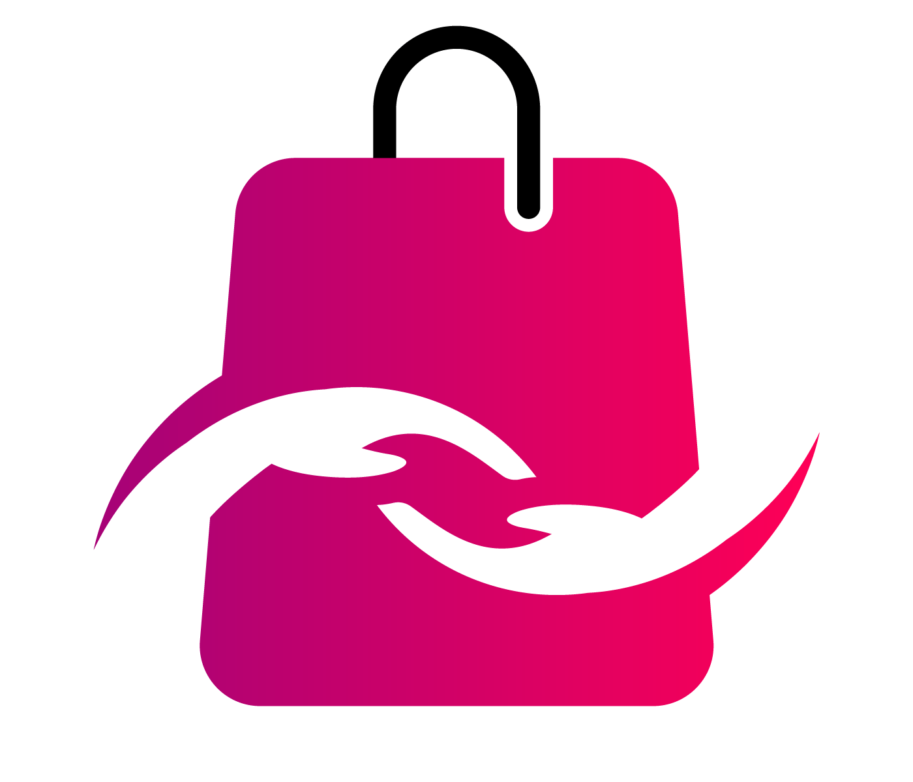

<a name="readme-top"></a>
 
 
<!-- PROJECT LOGO -->
<br />
<div align="center">
  <a href="https://github.com/ibrsec/shopping-vite/">
    
  </a>

  <h3 align="center">Shopping Vite Project</h3>

  <p align="center">
    An awesome Shopping Vite Project
    <a href="https://github.com/ibrsec/shopping-vite"><strong>Explore the docs »</strong></a>
    <br />
    <br />
    <a href="https://ibrsec.github.io/shopping-vite/">View Demo</a>
    ·
    <a href="https://github.com/ibrsec/shopping-vite/issues">Report Bug</a>
    ·
    <a href="https://github.com/ibrsec/shopping-vite/issues">Request Feature</a>
  </p>
</div>


<!-- TABLE OF CONTENTS -->
<details>
  <summary>📎 Table of Contents 📎 </summary>
  <ol>
    <li><a href="#about-the-project">About The Project</a></li>
     <!-- <li><a href="#figma">Figma</a></li> -->
     <li><a href="#overview">Overview</a></li>
     <li><a href="#quick-setup">Quick Setup</a></li>
     <li><a href="#directory-structure">Directory structure</a></li>
     <li><a href="#built-with">Built With</a></li>
    <!-- <li>
      <a href="#getting-started">Getting Started</a>
      <ul>
        <li><a href="#prerequisites">Prerequisites</a></li>
        <li><a href="#installation">Installation</a></li>
      </ul>
    </li>
    <li><a href="#usage">Usage</a></li>
    <li><a href="#roadmap">Roadmap</a></li>
    <li><a href="#contributing">Contributing</a></li>
    <li><a href="#license">License</a></li>
    <li><a href="#contact">Contact</a></li>
    <li><a href="#acknowledgments">Acknowledgments</a></li> -->

    
  </ol>
</details>


---

<!-- ABOUT THE PROJECT -->
## ℹ️ About The Project

[](https://ibrsec.github.io/shopping-vite/)


<p align="right">(<a href="#readme-top">back to top</a>)</p>


---

<!-- ## Figma 

<a href="https://www.figma.com/file/ePyCHKsx2ODB32uLgyUEEd/bootstrap-home-page?type=design&node-id=0%3A1&mode=design&t=edDzadCB9Ev5FS1a-1">Figma Link</a>  

  <p align="right">(<a href="#readme-top">back to top</a>)</p>


--- -->

## 👀 Overview

📦 POMOTODO App for tracking time and the tasks. </br>
🎯 Adjustable Theme  </br>
🌱 Add, Edit, Delete Tasks </br>
💪 Track time and pomodoros for selected Task  </br>
🔩 Get a random joke when you are tired   </br>
🐞 Check the finished tasks   </br>
<!-- 🖥 Easy to implement multiple windows   -->


<p align="right">(<a href="#readme-top">back to top</a>)</p>

## 🛫 Quick Setup

```sh
# clone the project
git clone https://github.com/ibrsec/shopping-vite.git

# enter the project directory
cd shopping-vite

# install dependency
npm install || yarn install

# develop
npm run dev || yarn start
```

<p align="right">(<a href="#readme-top">back to top</a>)</p>


<!-- ## 🐞 Debug

 -->


## 📂 Directory structure 

```
shopping-vite  (folder)
  
|          
|---public (folder)
|      |---assets
|      |     └---img (folder) 
|      |
|      └---src (folder)
|          |---cartCalculations.js
|          |---createBtns.js
|          |---getAllDataApi.js
|          |---localStorage.js
|          |---search.js
|          └---sendCardsToDom.js
|          
|----index.html   
|     └---style.css   
|          
|----main.js
|----package.json
|----package-lock.json
|----readme.md
└----vite.config.js
```

<p align="right">(<a href="#readme-top">back to top</a>)</p>

---

### 🏗️ Built With

 
<!-- https://dev.to/envoy_/150-badges-for-github-pnk  search skills-->

 
  
  
  
 <!--   -->
  
 


<p align="right">(<a href="#readme-top">back to top</a>)</p>


